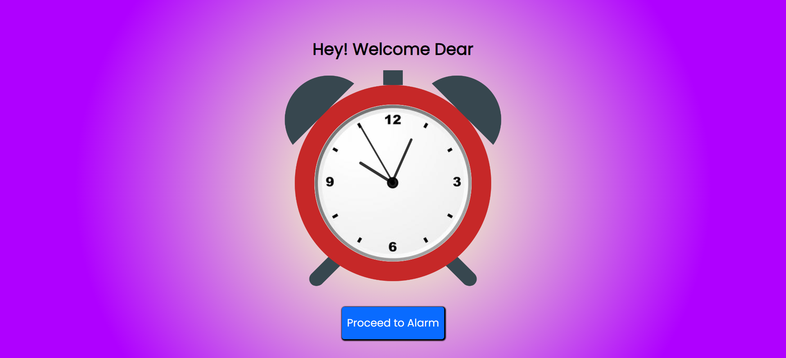
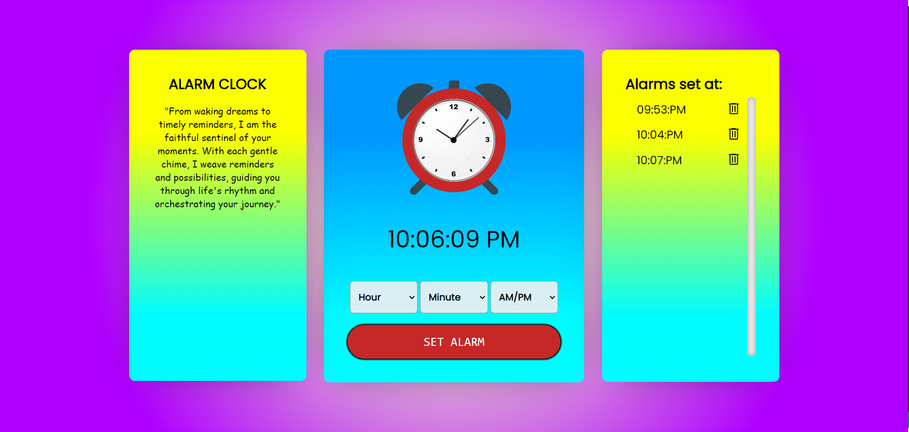
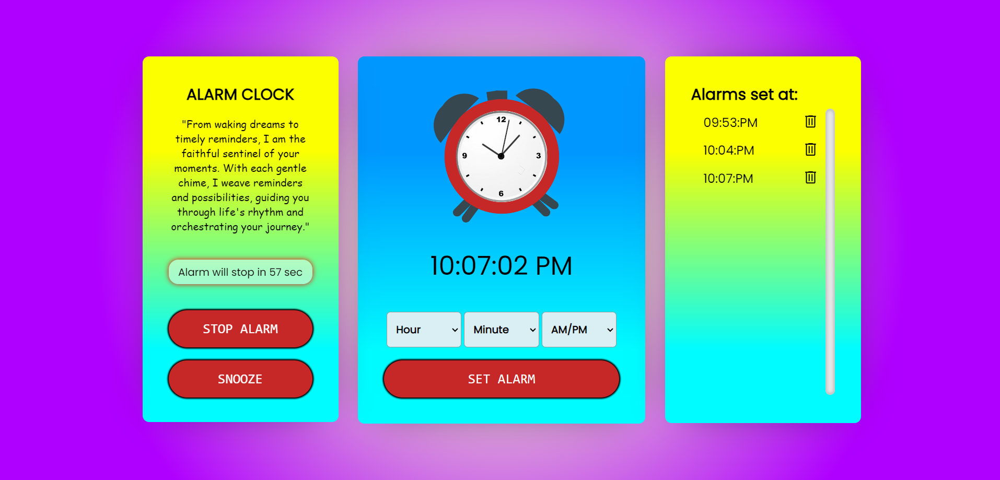

# ALARM CLOCK

It is  Coding Ninjas Skill Test Project for Front-End. Please visit the Coding Ninjas website [CodingNinjas ](https://www.codingninjas.com/) for more details.

## Table of contents

- [Overview](#overview)
  - [Screenshot](#screenshots)
  - [Built with](#built-with)
- [Author](#author)
- [Acknowledgments](#acknowledgments)
- [Deploy Link](#deployed-link)

## Overview

🔴 This is a front-end alarm clock project. 
🔴 It has very similar features to an Alarm Clock. 
🔴 You can set an alarm at any desired time, the alarm ringtone will play at that time. 
🔴 The most important thing about this project is it makes use of local storage of your browser to store the alarm timings, that means if you accidentally close the tab or entire window, the alarm you set is not gone. When you revisit the page you find the timings set by you. 
🔴 It also has features to stop the alarm and also to snooze.

### Screenshots
🔴 This is my Welcome page 
  
🔴 This is the main page for setting new alarms 
  
🔴 This is the preview of the alarm while playing 
 

### Built with

- HTML
- CSS
- JavaScript

## Author

- Github - [Subha Biswal](https://github.com/20SB)

## Acknowledgments

This project is done by me from scratch by referring to google and coding ninja.

## Deployed Link
-[ALARM CLOCK](https://alarm-clock-subha.netlify.app/)
